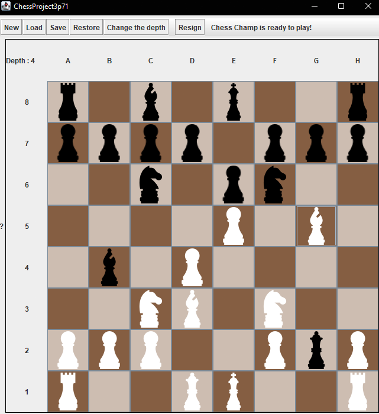

As a project for my class, me and my friend, developed a chess engine using alpha beta pruning. We used coding patterns such as contracts, factories, and abstract data classes. To ensure a good structured solution was provided. This repo is kept private so that, students from Brock university cannot copy code for their own project.

The biggest issue with this solution was that, it was memory hungry, and we couldn't really go beyond a certain level of depth for the decision tree, as we used a 2d array with all the piece information, and created a copy of that each time. It was slow and extremely heavy, and if next time I create this game again, I have learned a quite a few lessons from this adventure.
